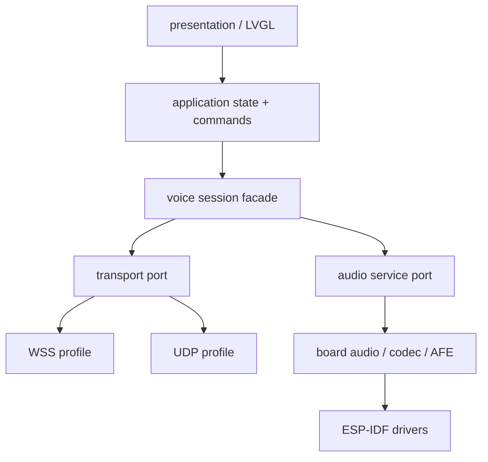

# Firmware 架构

状态：accepted migration target
更新日期：2026-07-20

## 1. 范围与基线

首个 target 为立创实战派 ESP32-S3，固定上游 `xiaozhi-esp32@7b190b78e4f8dfef14126f6cd478c134b3cd3cd8`，
ESP-IDF `v5.5.2`（revision `30aaf64524299d3bde422ca9a2848090d1bc5d0f`），board `lichuang-dev`。
`firmware/targets/lichuang-dev/` 中的 pinned-upstream + overlay 是唯一 production composition；随后仍可按 owner
逐模块抽取，但不以一次重写替代已经验证的 UI、音频、AEC 和 WSS 行为。

上游 board config 的事实：`AUDIO_INPUT_REFERENCE=true`、`CONFIG_USE_DEVICE_AEC=y`、AFE 输入格式 `MR`，
realtime listening 期间播放不停止 voice processing。这只证明配置和源码路径，不证明最终固件 AEC、
double-talk 或声学效果已通过。

## 2. 依赖方向



核心约束：

- `transport` 不依赖 LVGL、具体屏幕或触摸。
- `audio` 不依赖 WSS/UDP JSON。
- `board` 集中 GPIO、I2C/I2S、codec、PA 和显示触摸事实。
- `presentation` 只订阅状态/文本并发送 command；无屏工程可不链接 LVGL。
- wire 常量来自根 `protocol/` 的生成/合同约束，不维护第二份手写定义。

## 3. 目标组件

```text
firmware/
  targets/lichuang-dev/        # 唯一 production composition
  device/                      # non-release component-extraction prototype
    components/
      voice_contracts/         # generated protocol constants/admission helpers
      voice_session/           # lifecycle, generation, command/event facade
      voice_audio/             # capture/render/Opus/AEC-facing ports
      voice_transport_wss/
      voice_transport_udp/
      voice_board_lichuang/
      voice_presentation_lvgl/ # 可选
```

组件只在迁移到该 owner 时创建。`firmware/device` 在通过等价门禁并被新的决策纳入 production composition 前，
不生成 release firmware。Production target 内的 overlay 是当前产品实现，不是可被 prototype headless build 替代的
“参考目录”。

## 4. 音频流水线

### Uplink

I2S/TDM capture -> ESP-SR AFE/device AEC/VAD -> 16 kHz mono PCM -> Opus 60 ms encode -> selected transport。

### Downlink

selected transport -> Opus packet admission -> reorder/jitter -> Opus decode/PLC -> 24 kHz mono render path -> codec/PA。

协议固定上行为 16 kHz、mono、60 ms。Server hello 输出 sample rate 可为 16 kHz 或 24 kHz；当前 reference
playback 使用 24 kHz。任何采样率变化必须同时验证 codec、resampler、buffer cadence、AEC reference 和协议。

### 实时约束

- capture、Opus encode、network receive、Opus decode/render 分 task 管理。
- 每个 queue 记录 producer、consumer、帧单位、媒体时长、满载策略和 shutdown。
- DMA buffer 使用硬件支持的 memory capability；不得未经证据假设 PSRAM 可直接 DMA。
- 音频热路径不做无界分配、日志、JSON、Flash 写入或网络重连。
- playback 只保留 1 至 2 个解码帧量级的 live queue；UI/预缓冲参数变化必须实测卡顿和 stop tail。

## 5. Session 与 transport lifecycle

- WSS control owner 为 session 根生命周期。
- 每次连接产生单调 `connection_generation` 和不可变 session snapshot。
- 所有控制发送和媒体 callback 必须验证 generation，旧连接不得使用新 owner。
- UDP `RequestStop()` 首先发布 revocation、停止 ingress/新 send admission，再由 owner 有界 join。
- 断开回调不执行完整 teardown；supervisor/application task 统一关闭。
- WSS 断开、UDP 失活或网络切换后废弃 key/session，fresh reconnect；不做 same-session transport switch。
- 底层已进入的单次 send 可能无法取消，接收端必须依赖 generation/AEAD/session epoch 拒绝迟到包。

## 6. UI 与持久化

首个 UI 保留已验证的 Xiaozhi 交互风格：连接/聆听/思考/播放/错误状态，流式 ASR/TTS 文本，触摸交互
按钮，以及仅显示 `WSS`/`UDP` 的模式切换控件。

NVS 规则：

- 已保存 Wi-Fi 优先于 ignored local-lab 默认值。
- endpoint 优先级为 `voice_agent` NVS > ignored local config > upstream NVS。
- `ws_url` 只接受 host 非空、长度不超过 255 bytes 的 `ws://`/`wss://`。
- token 按 WebSocket origin 绑定；origin 改变时不得把旧 bearer 转发到新服务。
- NVS 写失败必须留在可恢复状态并显示错误，不得假装保存成功。
- Wi-Fi 密码、token、API key 和生成配置头不得 tracked。

## 7. 并发与资源 ownership

| 资源 | 唯一 owner | 停止语义 |
| --- | --- | --- |
| I2C/I2S/codec/PA | board audio service | 逆序停止 DMA、codec、bus；重复 stop 幂等 |
| capture/AFE | audio input task | revocation 后不再投递，等待有界 task exit |
| Opus encoder | uplink audio task | session generation 变化清空待发包 |
| WebSocket | WSS transport owner | callback 只投递事件，owner 统一 close/reset |
| UDP socket/session | UDP media owner | `RequestStop` 快速撤销，随后有界 join |
| playback queue/decoder | playback task | generation 变化清空旧音频；缺包按 deadline PLC |
| LVGL objects | UI task | 其他 task 通过 command/event，不直接操作对象 |

当前已知技术债以 `firmware/targets/lichuang-dev/KNOWN_DEBT.md` 为准，包括部分统计字段数据竞争、
底层单次 send 取消边界和第三方线程安全依赖。技术债不能被文档中的目标接口掩盖。

## 8. 可移植性

迁移到其他工程时可选择：

- 仅 `voice_contracts + voice_session + voice_audio + transport`，不迁 LVGL。
- 替换 `voice_board_lichuang` 适配新 codec/I2S/AFE。
- 只启用 WSS，禁用 UDP component。
- 未来新 endpoint 消费同一 wire schema/fixtures，但不复用 ESP-IDF task 实现。

## 9. 验证状态

固件复现门禁收口于 commit `cf9bc69`。新仓独立 materialization 后，当时的 composition `0001..0010` 已通过 source
contract、wire fixture、patch round-trip 和 ESP-IDF 5.5.2 clean build：`2215/2215`，`xiaozhi.bin=0x2d2660`，
app partition 余量 `0x11d9a0`（约 28%），DIRAM `170887/341760`（50.0%），artifact SHA-256 为
`43bac4d4ed678b3298cc9f4c8e9da0c4ab7608af731406cec31939ee457350c8`。证据等级仅为 `build_passed` 与
`image_sized`，且该 ignored local-config artifact 不得提交或发布。

该历史 artifact 已烧录至 COM11 的 ESP32-S3 rev0.2（8 MB PSRAM）：仅擦除 NVS
`0x9000/16 KiB`，随后写入完整 bootloader、partition table、otadata、app 和 assets，写入后各分区 hash verified。
Boot log 观察到 Wi-Fi“广告位招租”连接并取得 `192.168.1.105`，display、audio codec、ES7210、AEC、VAD 和
wake model 初始化，无 panic/WDT，达到 `boot_observed`。Display 初始化日志不等于 UI 视觉正确，触摸和 UI
仍需人工独立验收。

设备唤醒词“你好小智”成功，WSS handshake 约 20 ms，UDP GCM probe 首次成功并进入 ready，AEC 使用
`VOIP_HIGH_PERF`，连续发送 600+ UDP Opus uplink packets。该证据可证明指定 artifact 的唤醒、采集和已观察的 WSS/UDP transport
路径；自动播放测试语句期间设备采集 peak 偏低，未触发真机 ASR，因此不得声称 ESP32 ASR/TTS/LLM、字幕、
打断或声学闭环。UI/触摸人工验收、真机 ASR/TTS、20 轮、不同距离声学、弱网和 30 分钟长稳仍为
`not_run`。

当前 `0011..0014` 与 managed `0003..0008` composition 使用公网 Director 配置完成 ESP-IDF 5.5.2 clean build；
`xiaozhi.bin` 为 `2,970,272` bytes，SHA-256 为
`61542dad78a11a130263952e4148f9b7c70b1e8919e3f2ca192d21612e6716a3`，app 余量约 28%，DIRAM 为
`170,991 / 341,760`（50.03%）。
该 app 已写入 COM11 并 hash verified。电脑 TTS 唤醒后，当前 artifact 完成公网 Director/WSS、AFE AEC、
ASR“请用一句话介绍你自己”、流式字幕、`listening -> speaking -> listening` 与板端 playback；100 帧 underrun
为 0、max write 62.3 ms，无 ERROR/panic/WDT。该单次 smoke 不外推为正式声学或延迟 SLO。
`0014` 的“AI”文案、有界 4 包发送、停止清队列和 generation fence 已通过 source contract；物理视觉与点击结束
仍未手指 HIL。`cb544...` 的 350 帧零 underrun 保留为历史证据；当前 artifact 的 UDP provider、
UDP provider 闭环、UI/触摸、正式声学/弱网/20 轮/30 分钟仍为 `not_run`，完整边界见
[firmware/MIGRATION_STATUS.md](../../firmware/MIGRATION_STATUS.md)。
