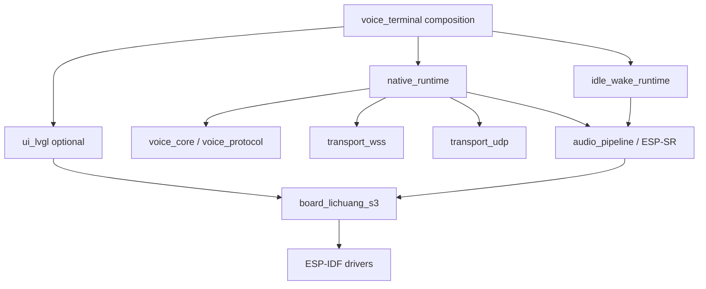

# Firmware 架构

状态：accepted target architecture
更新日期：2026-07-26

## 1. 范围

首个 native endpoint 是立创实战派 ESP32-S3，使用 ESP-IDF 5.5.2。正式 application 入口是
`firmware/apps/voice_terminal`；`firmware/components` 保存可复用实现。已退役实现只由 Git 历史和
ADR 记录，不进入当前固件 composition。

## 2. 依赖方向

- 核心语音、audio 和 transport 不依赖 LVGL。
- `board_lichuang_s3` 集中 GPIO、I2C/I2S、codec、PA、display 和 touch 事实。
- `voice_protocol` 消费 canonical RVA contract；UDP 必须消费唯一 canonical fixtures。
- UI 只通过有界 command/event queue 订阅状态和发出用户命令。

## 3. 组件职责

| Component | 职责 | 不负责 |
| --- | --- | --- |
| `board_lichuang_s3` | bus、codec、TDM、PA、ST7789、FT5x06 | session、JSON、Agent |
| `audio_pipeline` | capture/frontend/playback lifecycle | transport/reconnect |
| `audio_frontend_esp_sr` | 24 kHz `MR`、AEC/VAD、16 kHz output | Opus、UI |
| `device_config` | endpoint/token origin、Wi-Fi plan | ESP-IDF persistence implementation |
| `voice_protocol` | RVA control、typed media header | socket ownership |
| `transport_wss` | callback queue、fragment、send、supervisor close | audio decode/render |
| `transport_udp` | AEAD、probe/source pin、replay、jitter/freshness | WSS control lifecycle |
| `idle_wake_runtime` | idle 阶段 capture/AFE/WakeNet owner、有界 stop/join | 会话期 KWS、打断裁决 |
| `native_runtime` | bootstrap、tasks、Opus、session composition | LVGL object ownership |
| `ui_lvgl` | state reducer、text/status、touch commands | network/audio |

## 4. 音频数据流

Uplink：ES7210 TDM capture -> ESP-SR AFE/AEC/VAD -> 16 kHz mono PCM -> Opus 60 ms -> selected transport。

Downlink：selected transport -> identity/sequence/generation admission -> Opus decode/PLC -> PCM playback -> ES8311/PA。

AEC reference 要求 playback 与 microphone 同时进入 ESP-SR `MR` 输入。Capture、frontend、Opus encode、network、
decode/playout 分 task 管理；每条 queue 有固定容量、超时、停止和 overflow 语义。音频热路径不写 Flash、不解析
JSON、不执行重连或无界日志。

`model` 分区承载 WakeNet/NSNet。待机时 `idle_wake_runtime` 独占 capture/AFE，启用 `wn9s_hiesp`；唤醒命中后先
停止并 join feed/fetch task，再停止 capture/AFE 和关闭 WakeNet，随后才允许 `VoiceRuntime` 启动会话音频。会话结束后
重新建立 idle owner。模型分区缺失时降级为 MIC 启动，并关闭依赖模型的神经降噪；不能让 idle 与会话 runtime 同时
持有 codec/AFE。该生命周期已完成单次实机交接，重复循环、异常停止和声学效果仍以 release readiness 为准。

## 5. Session 与 transport

1. Wi-Fi 连接后向 Director bootstrap，声明 `rva/1` 和支持的 profiles。
2. 使用短期 grant 连接 `/rva/v1/voice`，发送 `session.open`。
3. `session.opened` commit 唯一 profile、session/media identity 和 limits。
4. WSS 或 UDP media owner 驱动同一 audio/Agent session；不做 mid-session switch。
5. Endpoint VAD/wake onset 只上报音频，不裁决打断、不清空播放队列。只有收到服务端 `playback.stop` 或用户通过
   明确 UI 命令发送 `response.cancel.request` 后，playback owner 才推进 fence 并停止目标 response。
6. WSS 断开、Wi-Fi 变化或 fatal error 后 supervisor 有界 teardown；`Stop -> Start` 不复用 runtime/grant，而是完成
   exact lease release 后 fresh bootstrap，获得新的 epoch/fencing/grant。

Callback 只复制有界事件并入队；不得在 callback 中 close/destroy。Supervisor 是 socket、task 和 session
teardown 的唯一协调者。WSS close/destroy 未在外层 watchdog 内确认时，runtime 不得继续原进程重连；它先
best-effort release 当前 exact lease，再受控重启，避免旧 callback/task/heap 与新 session 并存。

Playback task 独占 Opus decoder、reorder/playout queue、PLC、DAC 和 `playback.started/ended` 事实。Capture/uplink、
VAD callback、control callback 不得直接 reset decoder 或清队列，只能向 playback mailbox 投递带 target/fence 的命令。
WSS/UDP uplink generation 固定为 `0`；downlink 只接受当前 `response_id + generation`，并在 sequence drain 后上报
真实 `played_samples` 与最后实际播放的 sequence，禁止用 `0` 伪造不存在的 sequence。

UDP 下行通过 reorder/jitter 与 generation fence 后，在 decode/playout 前还有 360 ms 最终 media-age gate。超过该
年龄的 frame 清零并丢弃、递增 `media_age_dropped`，runtime 分类为 `udp_media_age` 并结束当前 session；后续按策略
fresh bootstrap，不播放已经失去实时价值的旧 TTS。

## 6. UI 与配置

Home UI 显示 AI、连接/对话状态、流式 ASR/response 和 `WSS`/`UDP` 文字模式。Idle+online 点击 mic 发出 start；
listening/thinking/speaking 点击只产生显式用户 stop request，不与端侧 VAD 复用。中文字体作为
Product-owned/generated asset 注入并由 native target 管理。

当前配置关闭 `CONFIG_RVA_AUTO_START_CONVERSATION` 并启用 `CONFIG_RVA_MIC_BUTTON_CONTROLS_SESSION`。设备联网后保持
idle WakeNet；`Hi ESP` 或 Idle 状态 MIC 点击建立 fresh session，活跃状态 MIC 点击发出显式 stop/cancel。模式切换只在
Idle 生效，单个 session 内不做 transport 热切换。

Wi-Fi 与 endpoint 配置遵循：saved value 优先、失败可回到配置页、写入后重启可回读。Token 与 endpoint origin
绑定；origin 改变不得转发旧 token。源码、tracked defaults、日志和 UI 不包含 Wi-Fi 密码、bearer 或 API key。

## 7. Ownership 与停止

| 资源 | Owner | 停止语义 |
| --- | --- | --- |
| I2C/I2S/codec/PA | board owner | 先停 DMA/codec，再逆序释放 bus；重复 stop 幂等 |
| capture/AFE | audio tasks | revoke 后不再投递，有界 join |
| Opus encoder/decoder | media tasks | session/generation 改变清空旧状态 |
| WSS | WSS supervisor | callback 只入队；owner close/destroy |
| UDP socket/session | UDP supervisor | 先撤销 admission/key/source，再停止 task/socket |
| LVGL objects | LVGL port task | 其他 task 仅发送 command |

## 8. 可移植性

无屏 endpoint 不链接 `ui_lvgl`；新板卡替换 board component；只需要 WSS 的产品可不链接 UDP。协议 schema、
fixtures 和 Server binding 可被其他 endpoint 复用，但 FreeRTOS task、driver 和 LVGL 实现不外泄为跨平台 API。

## 9. 验证状态

Host/contract/build/device/acoustic evidence 必须分开。当前精确状态和未运行项见
[Release readiness](../quality/release-readiness.md)。
