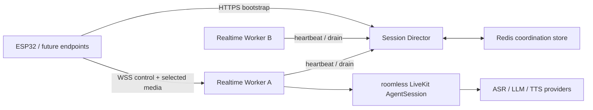
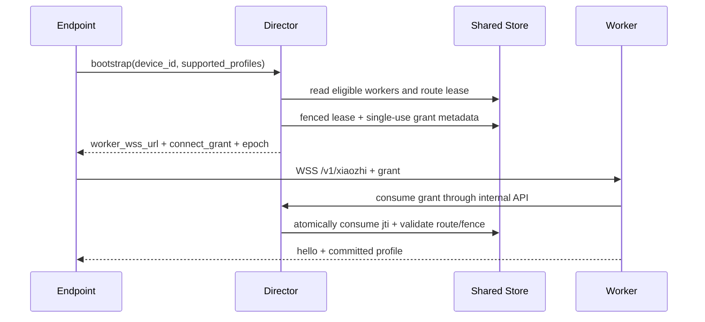

# 系统架构

状态：accepted target architecture
更新日期：2026-07-20

## 1. 架构目标

系统以稳定控制面和 stateful 实时 Worker 分离实现水平扩展，同时保持一对一媒体单跳。ESP32-S3 是首个
endpoint；未来浏览器、手机或其他 MCU 应通过新的 binding/profile 接入，而不是修改 Agent 核心。

## 2. 部署单元与职责

### Session Director

- 提供设备 bootstrap 稳定入口。
- 维护 Worker registry、heartbeat TTL、capacity、health 和 drain 状态。
- 为 `tenant_id + device_id` 分配 route lease、递增 fencing token 和 session epoch。
- 签发绑定 Worker、设备、epoch、profiles、expiry 和 `jti` 的短期 connect grant。
- 执行全局 admission；不创建 AgentSession，不读取或转发媒体帧。

### Realtime Worker

- 终止 `/v1/xiaozhi` WSS control。
- commit `wss-opus-v1` 或 `udp-opus-gcm-v1`，并持有对应媒体 transport。
- 一个 active session 内唯一持有 AgentSession、codec、provider stream、playback generation 和 teardown。
- 执行本地 `max_sessions` admission，默认 `5`，可按部署配置覆盖。
- 上报 heartbeat、active sessions、profiles、health 和 draining。

### Coordination Store

- 生产使用 Redis-compatible shared store，保存带 TTL 的 Worker registry、route lease、fencing 和 grant 单次消费状态。
- `memory` backend 只允许单进程开发和确定性测试，不能证明多实例安全。
- store 不进入逐帧媒体、VAD、ASR、TTS 或 playback 路径。

### Provider

- ASR、LLM、TTS 通过 Worker 内 adapter 接入。
- 连接池、模型资源和 concurrency bulkhead 尽量进程级复用；stream、请求、取消和 conversation 保持 session 级隔离。
- Provider 失败映射为有界 close/retry policy，不允许旧 generation 输出恢复进入播放。

## 3. 核心不变量

1. 一个 `tenant_id/device_id/session_epoch` 最多一个 active Worker owner。
2. Director 不接触媒体、Agent turn、UDP key 明文使用过程或 provider stream。
3. WSS control 与 UDP media 必须落到同一个 Worker。
4. 一个 session 只 commit 一个 media profile；进行中不热切换。
5. 连接或 lease 失效后 fresh bootstrap，旧 epoch、grant、key 和 generation 全部失效。
6. 媒体热路径只访问进程内有界结构，不同步访问 Redis、数据库或消息队列。
7. `protocol/` 是 wire contract 唯一 authoring source。

## 4. 数据流

### Bootstrap 与路由

### WSS profile

WSS 同时承载 JSON control 和 binary Opus。WebSocket 的有序可靠语义简化接入，但 TCP loss 可能造成 HOL；
因此队列、message size、media age 和 stale generation 必须有界。

### UDP profile

WSS 继续承载控制、鉴权、grant 和 lifecycle；UDP 只承载认证后的 Opus datagram。authenticated probe 绑定
source，固定小型 reorder/jitter 等待处理轻度乱序，超时丢弃并使用 PLC。WSS 断开立即撤销 UDP session。

### Agent turn

Endpoint audio -> codec decode -> AgentSession input -> streaming ASR -> LLM delta -> 中文 TTS chunking -> streaming
PCM/Opus -> selected transport -> endpoint playout。Abort/近讲打断递增 generation，旧队列和旧网络包不得恢复。

## 5. 信任边界

| 边界 | 不可信输入 | 必须控制 |
| --- | --- | --- |
| Internet -> Director | device identity、bootstrap payload | TLS、schema、rate limit、quota、审计 |
| Endpoint -> Worker WSS | header、JSON、binary frame | grant、origin/size/state/session 校验、bounded queue |
| Internet -> Worker UDP | 任意 datagram/source | framing、AEAD、anti-replay、source pin、expiry、rate limit |
| Worker -> Provider | 用户音频和文本 | timeout、concurrency、data policy、错误脱敏 |
| Operator -> Config/Store | secret、capacity、endpoint | 最小权限、secret manager、rotation、审计 |

## 6. Failure domain

- Director 短时不可用：已建立且 lease 安全窗口内的 session 继续；新 bootstrap 失败。
- Redis 不可用：Director fail closed，不产生无 fencing 的新 owner；既有媒体不访问 Redis。
- Worker crash：该 Worker 上 session 终止，设备 fresh bootstrap；不迁移 active turn。
- Provider 超时/429/5xx：隔离在 Worker/provider bulkhead，按可重试分类关闭或重试请求，不重放副作用。
- UDP blocked：`auto` 当前保守使用 WSS；显式 UDP 测试失败则关闭 fresh session，不在同 session 偷切 WSS。
- Wi-Fi 切换/WSS 断开：撤销 UDP key，清空播放 generation，重新建立 session。

## 7. 当前实现与目标差距

Server commit `fca8de8` 已实现 Director、memory/Redis store、Realtime Worker、shared contracts 与 providers；
`259aeee` 收紧 coordination readiness 与 one-way drain，`d2fa0ca` 完成 public Worker URL 和 launcher process
lifecycle 边界。`d2fa0ca` 历史快照的 Redis-enabled pytest 为 `179 passed`；当前工作树完整 Redis-enabled suite
为 `189 passed`、`0 skipped`，Server Ruff 通过，shared `jti` 原子单次消费及 Redis 重启/跨实例语义已有测试
证据。真实进程 host synthetic Chinese 已经通过 Director grant + WSS/UDP Opus/GCM 完成 FunASR final、DeepSeek
HTTP 200、CosyVoice HTTP 200 和 downlink audio；单次观测约为 STT 480 ms、LLM TTFT 9876 ms、TTS TTFB
594 ms，不外推为 SLO。

当前 production composition 的公网 Director artifact SHA-256 为
`61542dad78a11a130263952e4148f9b7c70b1e8919e3f2ca192d21612e6716a3`。该 app 已在 COM11 烧录并 hash
verified。电脑 TTS 唤醒后，该 artifact 完成 public Director/WSS、AFE AEC、ASR、流式字幕、TTS/playout 与
`listening -> speaking -> listening`，100 帧 underrun 0、max write 62.3 ms，无 ERROR/panic/WDT。`0014` source
contract 和 clean build 已通过，物理“AI”视觉与聆听点击结束未 HIL。当前 artifact 的 UDP provider HIL、
UI/触摸、弱网、正式声学、20 轮和 30 分钟仍为
`not_run`。Host 从外部网络完成的 `8093/udp` probe/ACK 只证明公网 UDP endpoint 可达。

## 8. 演进边界

- 浏览器/手机出现真实需求时，可新增标准 LiveKit Room binding；不把 Room/SFU 引入 ESP32 profile。
- Worker endpoint 无法在目标网络可靠暴露时，重新评估 Edge Media Gateway；在此之前不预建媒体转发层。
- 第二个真实 Agent application 消费者出现后再提取业务 Agent package。
- Direct WebRTC/AIMP 不属于本仓迁移范围。
