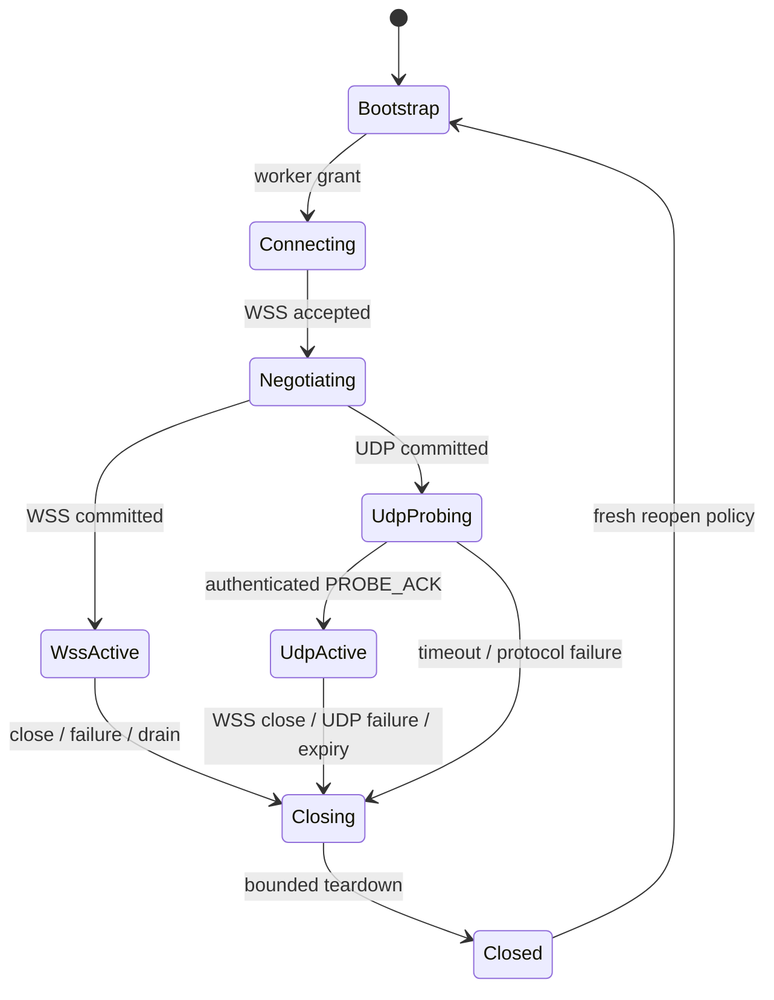

# Session 生命周期与错误语义

状态：accepted
更新日期：2026-07-23

## 1. 状态机

任何状态最多一个 owner。`Closing` 只能单向进入，重复 close 幂等；callback 不得创建第二条 teardown。

## 2. 超时

| Phase | 必须有界 | 超时结果 |
| --- | --- | --- |
| bootstrap/grant | HTTP client deadline | 不创建 Worker session，退避后重试 |
| WSS connect/session.open | connect + handshake timeout；Endpoint 发出 open 后 8 秒内必须收到 `session.opened` | close，best-effort release 当前精确 lease，fresh bootstrap |
| UDP probe | grant `probe_timeout_ms` | close整个 session，fresh bootstrap |
| Agent startup/terminal | session start timeout；unexpected typed terminal | `session.error` best-effort 后 close `1011/runtime_failure` |
| media queue/freshness | 小于可接受 media age | 丢弃 stale backlog 到 live edge；当前 close `1013/media_overloaded` 后 fresh reopen |
| provider request | provider-specific deadline | cancel/close，禁止无界等待 |
| endpoint playback terminal | `response.end` send ack 后默认 3 秒，可由 `VOICE_RVA_PLAYBACK_TERMINAL_TIMEOUT_SECONDS` 配置 | `session.error(playback_terminal_timeout)` 后 close `1011/playback_terminal_timeout` |
| drain/teardown | process shutdown deadline | 强制撤销并记录未收敛 owner |

## 3. WebSocket close 映射

`rva/1` 的 `session.error` 只报告有界、分类后的 session 错误；连接 terminal 仍使用标准 close code 和有限
ASCII reason：

| Code | Reason 类别 | 示例 |
| ---: | --- | --- |
| 1000 | normal | `normal` |
| 1001 | endpoint lifecycle | `server_shutdown` |
| 1002 | protocol error | `protocol_error`、错误状态/hello |
| 1008 | authentication/policy | `unauthorized`、`handshake_timeout` |
| 1009 | message too large | `message_too_large` |
| 1011 | runtime/provider fatal | `runtime_failure`、`playback_terminal_timeout` |
| 1013 | overload/retry later | `session_overloaded`、`media_overloaded` |

Reason 不包含 provider body、token、URL query、设备隐私或堆栈。实现可细分内部 `close_reason` metric，但 wire
reason 必须稳定且有限。

## 4. 错误分类

- `client_fault`：malformed JSON、duplicate key、wrong session、unsupported profile、invalid media。
- `auth_fault`：grant signature/audience/device/worker/expiry/jti/fencing 失败。
- `capacity_fault`：Director 或 Worker admission、provider bulkhead、queue overload。
- `transport_fault`：WSS disconnect、UDP probe/expiry/socket、media age。
- `runtime_fault`：AgentSession/codec/supervisor invariant 失败。
- `provider_fault`：timeout、429、5xx、invalid stream/audio metadata。
- `operator_fault`：配置缺失、endpoint 不可达、Redis/TLS/certificate 错误。

错误必须映射到明确 owner、retryability 和 close reason。Retryable 不等于 same-session 恢复；除纯 bootstrap
重试外，媒体/Agent 失败均 fresh session。

LiveKit `AgentSession` unexpected terminal 映射为 `session.error(runtime_failure)`（best-effort）和
`1011/runtime_failure`。Owner 发起的正常 close 不得误报为 runtime failure。Terminal 发布必须 exactly-once；一旦发布，
audio input admission 立即失效，已经阻塞和后续的 input push 均快速返回稳定错误，不能等 queue 填满后再归因为
`media_overloaded`。

Server 只有在 `response.end` 已被 WSS send owner 确认交付后才启动 exact-target playback terminal watchdog。收到匹配的
`playback.ended` 即取消 watchdog；deadline 到达仍是同一 active target 才 fail current session。Server 不伪造 Endpoint
物理事实，通知发送失败也不得覆盖 `playback_terminal_timeout` primary cause。

## 5. Freshness fences

- `session_epoch/fencing_token` 防止跨 Worker/route 的旧 owner。
- `connection_generation` 防止 ESP32 旧 callback 使用新 WebSocket owner。
- UDP `media_epoch + sequence + AEAD` 防止旧 session/replay datagram。
- Server-owned playback `generation + fence_generation` 防止 stop 后旧 TTS 恢复；uplink generation 固定 0。

四层 fence 各自解决不同生命周期，不得互相替代。

Uplink 同时受 received queue age 与 packet timestamp media-timeline age 约束。Server 只按 paced packet 的本包
arrival/media cadence error 做小幅有界校正；TCP stall/burst 和已经累积的 transport delay 不允许被重锚为 fresh。
超过 freshness budget 时，Server 丢弃 stale ingress 到当时 live edge，只用于阻止旧语音继续送入 ASR 和形成可诊断的
isolated-stale/backpressure 指标。

WSS packet 若在 Opus decode 和 runner push 之前已 stale，可在 10 秒窗口内最多恢复 2 次。drain 后已有 fresh packet
时直接回到 live edge；否则进入有界 catch-up：重置 consumer phase 与 WSS burst debt，丢弃 TCP 缓存追赶包，直到
连续 2 个接近 60 ms 的到达间隔证明恢复实时节奏。catch-up 最多丢弃两倍 freshness budget 对应的包数，并始终保留
timestamp sequence、cadence 和 oversized jump 校验。该路径不宣称重置 `AgentSession`。

超过 stale 恢复预算、catch-up 丢弃预算、partial runner push、UDP stale、持续 backlog 或真实 backpressure 均发送
`session.error(media_overloaded)` 后以 `1013/media_overloaded` 关闭，Endpoint 重新 bootstrap。这里的 retryable
表示 fresh session，而不是旧 session 内恢复。当前没有经过 public API 证明的同 `AgentSession` reset；Close 通知
超时不得把 primary cause 改写成 notification timeout。

## 6. Reconnect policy

Endpoint 对网络/服务失败采用有上限指数退避和随机抖动。认证/配置错误不得快速重试；应进入可配置 UI。
每次 reconnect 重新 bootstrap 或取得新 Worker grant，不复用 UDP key/sequence。Server 不保证未提交 turn 恢复。
设备取得 bootstrap grant 后若本地资源创建、WSS 建链或 session 运行失败，必须先完成本地 bounded teardown，再以
`tenant_id/device_id/worker_id/session_epoch/fencing_token` best-effort release。Director 只 compare-and-delete 完全匹配的
lease，旧请求不得撤销新 epoch；release 失败仍按退避策略 fresh bootstrap，不复用 grant。
Endpoint 必须先验证并保留最小 release identity，再解析其余 media 字段；这样 200 response 的 endpoint/profile 字段
无效时也能释放已创建的 lease。Release retry 必须同时有每次 HTTP deadline、尝试次数和总生命周期上限。`Stop ->
Start` 表示新 session，不允许在已 teardown 的 WebSocket owner 或旧 grant 上原地复活；WSS close/destroy 无法确认时
采用 fail-closed 重启。

## 7. 验证

必须覆盖 malformed/duplicate/oversize/wrong-session、expired/replayed grant、UDP auth/replay/source、exact-target
stop/fence race、cancel request idempotency、disconnect during handshake、double close、drain deadline 和 cancellation
storm。软件、真实进程、设备和声学
证据分级记录在 [Release readiness](../quality/release-readiness.md)，旧 artifact 不升级为当前版本证据。
