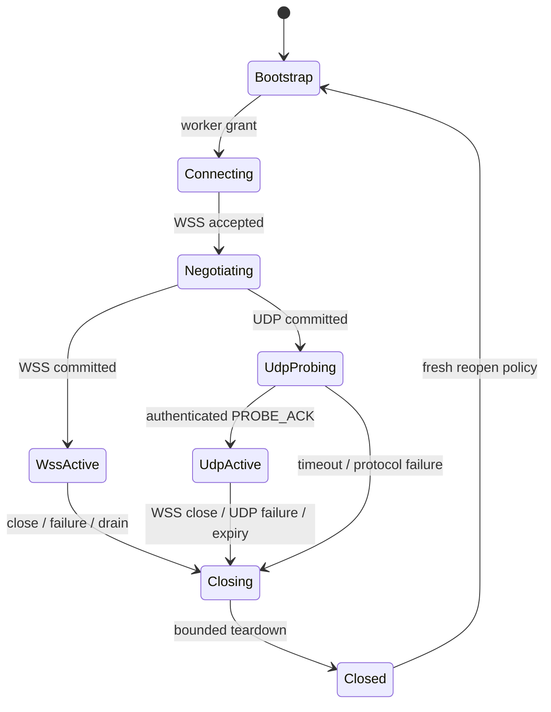

# Session 生命周期与错误语义

状态：accepted
更新日期：2026-07-20

## 1. 状态机

任何状态最多一个 owner。`Closing` 只能单向进入，重复 close 幂等；callback 不得创建第二条 teardown。

## 2. 超时

| Phase | 必须有界 | 超时结果 |
| --- | --- | --- |
| bootstrap/grant | HTTP client deadline | 不创建 Worker session，退避后重试 |
| WSS connect/hello | connect + handshake timeout | close，fresh bootstrap |
| UDP probe | grant `probe_timeout_ms` | close整个 session，fresh bootstrap |
| Agent startup | session start timeout | close `runtime_failure` |
| media queue put | 小于可接受 media age | drop/live-edge 或 `media_overloaded` |
| provider request | provider-specific deadline | cancel/close，禁止无界等待 |
| drain/teardown | process shutdown deadline | 强制撤销并记录未收敛 owner |

## 3. WebSocket close 映射

Core v1 不定义额外 error JSON；使用标准 close code 和有限 ASCII reason：

| Code | Reason 类别 | 示例 |
| ---: | --- | --- |
| 1000 | normal | `normal` |
| 1001 | endpoint lifecycle | `server_shutdown` |
| 1002 | protocol error | `protocol_error`、错误状态/hello |
| 1008 | authentication/policy | `unauthorized`、`handshake_timeout` |
| 1009 | message too large | `message_too_large` |
| 1011 | runtime/provider fatal | `runtime_failure` |
| 1013 | overload/retry later | `session_overloaded`、`media_overloaded` |

Reason 不包含 provider body、token、URL query、设备隐私或堆栈。实现可细分内部 `close_reason` metric，但 wire
reason 必须稳定且有限。

## 4. 错误分类

- `client_fault`：malformed JSON、duplicate key、wrong session、unsupported profile、invalid media。
- `auth_fault`：grant signature/audience/device/worker/expiry/jti/fencing 失败。
- `capacity_fault`：Director 或 Worker admission、provider bulkhead、queue overload。
- `transport_fault`：WSS disconnect、UDP probe/expiry/socket、media age。
- `runtime_fault`：AgentSession/codec/supervisor invariant 失败。
- `provider_fault`：timeout、429、5xx、invalid stream/audio metadata。
- `operator_fault`：配置缺失、endpoint 不可达、Redis/TLS/certificate 错误。

错误必须映射到明确 owner、retryability 和 close reason。Retryable 不等于 same-session 恢复；除纯 bootstrap
重试外，媒体/Agent 失败均 fresh session。

## 5. Freshness fences

- `session_epoch/fencing_token` 防止跨 Worker/route 的旧 owner。
- `connection_generation` 防止 ESP32 旧 callback 使用新 WebSocket owner。
- UDP `media_epoch + sequence + AEAD` 防止旧 session/replay datagram。
- playback `generation` 防止 abort 后旧 TTS 恢复。

四层 fence 各自解决不同生命周期，不得互相替代。

## 6. Reconnect policy

Endpoint 对网络/服务失败采用有上限指数退避和随机抖动。认证/配置错误不得快速重试；应进入可配置 UI。
每次 reconnect 重新 bootstrap 或取得新 Worker grant，不复用 UDP key/sequence。Server 不保证未提交 turn 恢复。

## 7. 验证

必须覆盖 malformed/duplicate/oversize/wrong-session、expired/replayed grant、UDP auth/replay/source、abort race、
disconnect during handshake、double close、drain deadline 和 cancellation storm。软件、真实进程、设备和声学
证据分级记录在 [Release readiness](../quality/release-readiness.md)，旧 artifact 不升级为当前版本证据。
